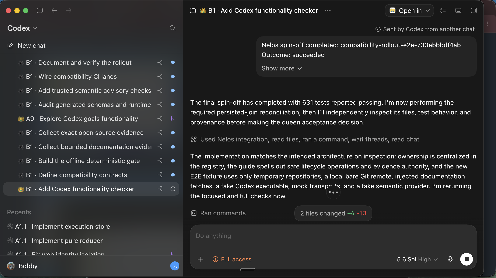
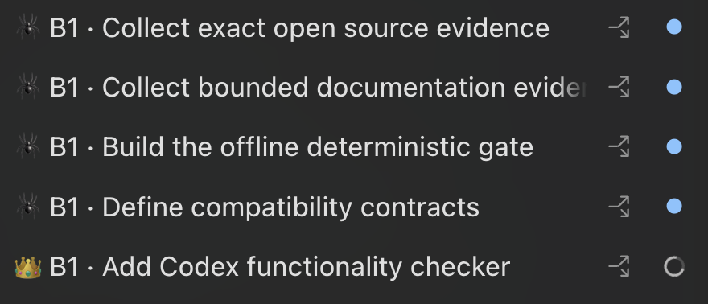
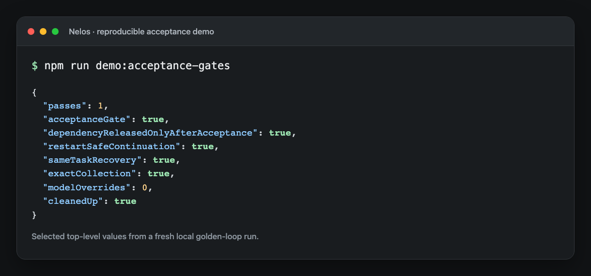

<h1 align="center">Nelos 👑🕷️</h1>

<p align="center">
  <strong>Bring the work. Nelos divvies it up.</strong><br>
  <em>Smarter orchestration. More parallel work. Better use of every credit. Just more better.</em>
</p>

<p align="center">
  <a href="#nelos-in-action">See it work</a> ·
  <a href="#quick-start">Quick start</a> ·
  <a href="#whats-in-the-box">What's in the box</a> ·
  <a href="docs/webs.md">Docs</a>
</p>

<p align="center">
  
</p>

<p align="center"><sub><em>One objective becomes a visible web of focused Codex tasks—and completed work reports back to the coordinator automatically.</em></sub></p>

---

## What is Nelos?

Nelos is a plugin for [Codex](https://developers.openai.com/codex) that combines
a task-management skill with an MCP orchestration server. Together they turn one
big task into a web of parallel, dependency-aware work — and add three things you
don't get from Codex, its native subagents, or hand-run parallel chats:

- **Smart Model + Reasoning Router:** The right model and effort for every
  slice — verified after launch. Nelos routes each slice to a fit-sized model
  and reasoning level, then confirms the task *actually ran* with that exact
  route and stops the moment it does not match. No silent downgrades, no
  burning `max`-effort reasoning on trivial work. [How routing works →](docs/routing.md)
- **Dependency-Aware Work Scheduler:** Parallel work that understands
  prerequisites. Slices launch in ordered *waves* — a later one starts only
  after the upstream work it needs has been accepted, not fire-and-hope.
- **Durable Task Orchestrator:** Workers you can still see, steer, and hear
  back from. Spinoffs remain ordinary Codex tasks in the desktop sidebar, and
  completed work reports back to the queen even when it is idle.

## Nelos in action

### The whole web stays visible

Every task in a web shares one compact ID, so related work is easy to spot in the
Codex sidebar. The crown marks the queen; spiders mark its durable spinoffs.
Each one remains an ordinary task you can open, inspect, or steer directly.

<p align="center">
  
</p>

<p align="center"><em>One B1 web: four focused spinoffs coordinated by one queen.</em></p>

### Dependencies wait for accepted work

Nelos can run independent slices in parallel, but it does not release downstream
work merely because an upstream task stopped. The result must pass the queen's
acceptance gate first, and the orchestration state survives restarts.

<p align="center">
  
</p>

<p align="center"><em>Run the same three-member proof with <code>npm run demo:acceptance-gates</code>.</em></p>

## Why "Nelos"?

**Nelos** comes from ***Anelosimus***, a genus of cosmopolitan cobweb spiders —
many of them *social*, cooperating on one shared web. That's the shape of the
tool: many focused agents working a shared **web** of tasks, led by a **queen**,
with durable branches called **spinoffs**.

## Quick start

> **Codex only** · macOS / Linux · Node.js 20+ · Windows not yet supported.

Install the plugin:

```bash
codex plugin marketplace add virusimmortal00/nelos --ref marketplace/stable
codex plugin add nelos@nelos-marketplace
```

`marketplace/stable` advances only to a published, validated stable release.
To upgrade later, refresh that marketplace snapshot and reinstall the plugin:

```bash
codex plugin marketplace upgrade nelos-marketplace
codex plugin add nelos@nelos-marketplace
```

Enable its bundled tools — Codex keeps plugin MCP servers off until you opt in —
by adding this to `~/.codex/config.toml`:

```toml
[plugins."nelos@nelos-marketplace".mcp_servers."nelos"]
enabled = true
```

Then restart Codex, open a fresh task, and ask:

```text
Use Nelos to plan this feature into safe parallel slices.
```

No installer, no manual copying, no `PATH` changes.
Exact release tags remain available for reproducible installs and rollback; see
[Installation and distribution trust](docs/installation.md#codex-marketplace-installs-upgrades-and-rollback).

## Codex compatibility

Nelos is tested against Codex CLI `0.144.5` and Codex Desktop `0.144.6`.
Codex `0.145.x` and later stable versions are allowed but have not yet been
verified against Nelos's full app-server test matrix. The
`nelos_app_server_health` tool reports the observed version, the tested
versions, and whether the current version has been tested.

Nelos requires Codex `0.144.5` or newer. It does not block a newer stable
release merely because that release has not been tested yet; instead, the
bridge continues to validate every app-server response and reports a focused
compatibility error if an operation's actual contract has changed. Prerelease
and custom build version identities are not treated as stable releases.

Pull requests use one required, token-free deterministic compatibility gate.
Run the identical command locally:

```bash
npm run compatibility:required
```

It compares the current `HEAD` with the merge base of
`COMPATIBILITY_BASE_REF`, `GITHUB_BASE_REF`, or `origin/main` (in that order),
removes `OPENAI_API_KEY`, and blocks network access for the gate and every
child test process. Scheduled drift, exact-release evidence, live runtime
smokes, and semantic advice run in separate workflows and cannot replace this
required status.

## What's in the box

Nelos is one Codex plugin with two parts:

- **An MCP server with a scoped Codex app-server bridge.**
  `nelos_plan_lifecycle` durably coordinates an exact Sol planning pass through
  typed, replay-safe receipts; `nelos_plan_slices` then plans dependency-safe
  waves and returns any required queen title effect before launch. Durable
  spinoff titles are read, set, and verified after native creation and binding.
  A repeated call verifies the compact role-first grammar:
  queens begin `👑 WEB_ID ·`, while durable spin-offs begin `🕷️ WEB_ID ·`.
  Thread inspection,
  inventory, bounded waiting, and health tools expose no prompts or transcripts.
  Batch launch verification gates every wave on lifecycle-appropriate identity,
  topology, and route evidence: joined subagents use their collaboration
  `agentPath`, while durable spinoffs use their task `threadId` and native
  title. Typed exceptions can trigger one bounded Sol
  replan without relaunching completed slices. Finishing spinoffs durably hand
  off through receipt-bound host wake effects from `nelos_spinoff_complete`;
  accepted members follow an explicit `ask`, `auto`, or `keep` cleanup policy
  through receipt-bound native archive effects. Intelligence routing,
  verification, and native subagent identity resolution remain read-only;
  callback orchestration tools journal native effects. The bridge starts one
  `codex app-server --stdio` child lazily and exposes no prompts or transcripts.
- **A skill** — `manage-nelos-tasks`, the playbook that bootstraps planning
  independently of the starting model and executes each tool's next action.

Spinoffs remain ordinary top-level Codex tasks—visible and steerable in the
desktop sidebar while Nelos coordinates. Nelos plans and coordinates; you still
own Git branches, merges, and final review.

## Learn more

- [Model & reasoning routing](docs/routing.md) — how each slice is sized, and verified
- [Native task orchestration](docs/task-orchestration.md) — durable create, title sync, crash-resume
- [App Server compatibility contract](docs/app-server-compatibility-contract.md) —
  minimum and tested-version policy, fallbacks, and hardening gates
- [Webs and terminology](docs/webs.md) — the queen / spinoff / web model
- [Slice planning](docs/slice-planning.md) — a full worked example
- [Worktree coordination](docs/worktree-coordination.md) — one writer per branch
- [Codex capability leverage audit](docs/codex-capability-audit.md) — the ordered,
  evidence-backed review of native Codex features Nelos should adopt, pilot,
  defer, or reject
- [Installation and trust](docs/installation.md) · [Development](docs/development.md)
- [Release and compatibility policy](docs/release-policy.md) · [Changelog](CHANGELOG.md)

## Contributing

The `nelos` CLI is a separate surface for contributors and automation. From source
(Node.js 20+):

```bash
npm install
npm run install:distribution
nelos --help
```

Please read [SECURITY.md](SECURITY.md) before reporting a vulnerability.

<details>
<summary>Upgrading from Fraktik</summary>

Nelos was previously published as **Fraktik** (through 0.2.1). The rename changes
the install identity, so remove the old plugin and delete any
`[plugins."fraktik@fraktik"...]` blocks from `~/.codex/config.toml`, then follow
the [Quick start](#quick-start):

```bash
codex plugin remove fraktik@fraktik
codex plugin marketplace remove fraktik
```
</details>

<details>
<summary>Installing from another marketplace</summary>

Nelos doesn't have to come from its bundled one-plugin marketplace. Add it to any
marketplace's `plugins` array, then install with `nelos@<marketplace-name>`:

```json
{
  "name": "nelos",
  "source": { "source": "url", "url": "https://github.com/virusimmortal00/nelos.git", "ref": "v0.4.0" },
  "policy": { "installation": "AVAILABLE", "authentication": "ON_INSTALL" },
  "category": "Developer Tools"
}
```
</details>

---

<sub>Independent open-source project — integrates with Codex, not affiliated with
OpenAI. [MIT](LICENSE) © Nelos contributors.</sub>
