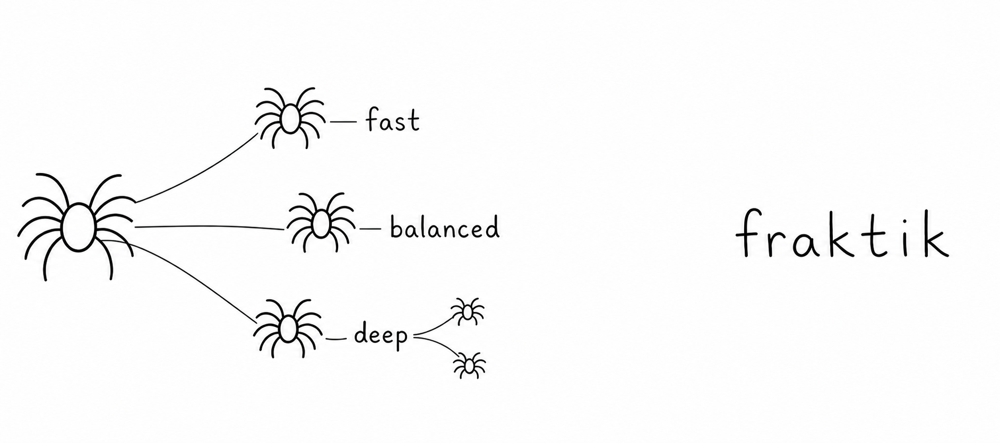

<p align="center">
  
</p>

# Nelos

**Plan complex Codex work into safe, dependency-aware parallel slices.**

Nelos helps you turn a large development task into a visible web of focused
subagents and durable tasks. It keeps dependencies explicit, suggests
model-and-reasoning profiles, and gives the coordinating task the evidence it
needs to decide when a later wave may start.

Nelos is an independent open-source project. It integrates with Codex but is
not sponsored, endorsed, or maintained by OpenAI.

## Install in Codex

This repository is both the standalone **Nelos** plugin and a convenient
one-plugin marketplace named **Nelos Marketplace**. To install Nelos by itself,
open **Plugins** in the Codex app, add `virusimmortal00/nelos` as a GitHub
marketplace source, then install **Nelos** from **Nelos Marketplace**. The
equivalent terminal commands are:

```bash
codex plugin marketplace add virusimmortal00/nelos --ref main
codex plugin add nelos@nelos-marketplace
```

Then enable Nelos's bundled planning tools. Codex deliberately keeps
plugin-bundled MCP servers disabled until you opt in, so add this block to
`~/.codex/config.toml`:

```toml
[plugins."nelos@nelos-marketplace".mcp_servers."nelos"]
enabled = true
```

Restart Codex, then start a fresh task so it discovers the bundled skill and
tools. A running desktop session can retain an old skill locator after the
plugin is installed or updated. If Codex reports an advertised skill path that
is unavailable or one directory above the versioned installed copy, restart
before changing anything in the plugin cache; if it persists, remove and
reinstall `nelos@nelos-marketplace`, then restart once more. That is the whole
setup: no distribution installer, no manual copying, and no `PATH` changes.
The bundled tools run through Node.js, so use Node.js 20 or newer on macOS or
Linux. The current distribution does not support Windows. The `nelos`
command-line interface is a separate, optional surface for contributors and
automation (see below); nothing in the installed plugin depends on it.

### Add Nelos to another marketplace

Nelos does not have to be installed from its bundled one-plugin marketplace.
A team or personal marketplace can include the standalone plugin alongside
other plugins by adding this entry to its `plugins` array:

```json
{
  "name": "nelos",
  "source": {
    "source": "url",
    "url": "https://github.com/virusimmortal00/nelos.git",
    "ref": "main"
  },
  "policy": {
    "installation": "AVAILABLE",
    "authentication": "ON_INSTALL"
  },
  "category": "Developer Tools"
}
```

Install selectors and configuration keys always use
`nelos@<marketplace-name>`. Replace `<marketplace-name>` with the containing
marketplace's top-level `name`.

## Start here

Ask Codex:

```text
Use Nelos to plan this feature into safe parallel slices.
```

Nelos will help decide which work is a short-lived built-in subagent and
which needs a durable, independently inspectable task. It can then organize
the work into waves, keep dependencies visible, and pause before advancing
until the coordinating task accepts the needed results.

Use a durable Nelos task when a workstream needs its own working directory,
later turns, a handoff, or a dependency gate. Use a built-in subagent for a
bounded investigation or review that returns directly to the current task.

## What Nelos adds

- A clear plan of bounded work slices and their dependencies.
- Parallel waves that launch only when accepted upstream work is ready.
- Reviewed model-and-reasoning recommendations for each slice.
- A lightweight task web that makes task relationships easier to inspect.

For a short conceptual overview, Nelos calls the coordinating task the
**queen**, independently managed tasks **spinoffs**, and the connected set a
**web**. The details are below when you need them.

## Why Nelos?

Codex's [built-in subagents](https://developers.openai.com/codex/subagents)
are ideal when the current task can delegate bounded work — repository
exploration, test analysis, focused review — and combine the returned results
into one response. A different coordination problem appears when a piece of
work needs its own lifecycle: a stable task identity, a separate working
directory, dependency gates, later turns, direct inspection, or an explicit
archive point. Nelos calls a durable Codex task directed by another task a
**spinoff**.

People sometimes describe this choice as “subagent versus full agent,” but
**full agent** is not a Codex primitive. An **agent** is the runtime actor
doing work; a **task** is the durable conversation that contains turns
(Codex's UI calls it a chat; the app-server protocol calls it a thread). Both
subagents and spinoffs run agents, and a subagent is not threadless — Codex
gives it an inspectable agent thread the parent can steer, wait for, or close.
The difference that matters is who owns the thread's context, result flow, and
lifecycle: a subagent completes a bounded part of the current task, while a
spinoff is created as a separate top-level task and stays independently
addressable after its initial turn.

| Question | Built-in subagent | Durable Nelos spinoff |
| --- | --- | --- |
| What is its contract? | Complete a bounded part of the current task. | Own a separately managed stream of work. |
| What is its Codex topology? | A child agent thread in the parent workflow. | A separate top-level app-server thread connected to the queen by Nelos metadata. |
| What context starts it? | Scoped instructions delegated by the current workflow. | A fresh thread started from the supplied prompt and configuration; the queen's transcript is not copied. |
| How do results return? | Codex reports the result to the parent, which consolidates it. | Output remains in the spinoff until the queen or user explicitly reads and integrates it. |
| How is it continued? | The parent steers, follows up with, waits for, or closes it through native subagent controls. | `nelos send` starts a later turn by task ID after the current turn finishes. |
| How is it configured? | It inherits the parent turn's live sandbox and approval choices. Custom-agent files can supply role, model, tools, and config defaults, including a sandbox default, but live overrides still win. | It can start with an explicit working directory, model, effort, sandbox, approval policy, or permission profile. |
| What is it best for? | Exploration, review, test runs, log analysis, and summarization needed by the current response. | Branch-backed deliverables, dependency gates, multi-turn work, handoffs, and work someone should revisit directly. |

Here, *spinoff* means a fresh top-level thread created with the Codex
[app-server](https://developers.openai.com/codex/app-server), not `thread/fork` and
not a built-in subagent. Its relationship to the queen is an orchestration
overlay; it does not change Codex's parent/child thread topology.

### What This Tool Adds

Codex users can already open separate chats without this tool. Nelos's
value is making their orchestration explicit, scriptable, and agent-operable.
It can place both kinds of work in one **web**, and it:

- starts detached, durable tasks and returns stable task IDs and links;
- records queen, member, and nested-web relationships in local state;
- keeps those relationships visible through task titles and shared web IDs;
- exposes explicit commands to inspect, wait for, continue, and archive tasks;
- turns queen-authored slices into dependency-safe parallel waves;
- routes every planned slice through reviewed model/reasoning guidance;
- teaches Codex when to prefer a native subagent or a durable spinoff; and
- keeps web topology locally synchronized with native task lifecycle actions.

The `🕸️` marker means “member of this web,” not “subagent” or “spinoff.” The
local web registry treats both member types uniformly; their underlying Codex
topology and lifecycle remain different.

## Terminology at a Glance

| Term | Web title marker | Meaning |
| --- | --- | --- |
| **Task** | — | A durable sidebar conversation. Codex's UI generally calls it a chat; the app-server protocol calls it a thread. |
| **Agent** | — | The runtime actor executing a turn inside a task; it has no durable task title of its own. |
| **Custom agent** | — | Reusable configuration for a spawned agent session, not a durable work container. |
| **Queen** | `🕷️ A1` | The task that starts, monitors, and integrates work across a web. |
| **Spinoff** | `🕸️ A1` | A separate top-level task started or directed by a queen, with its own lifecycle. |
| **Subagent** | `🕸️ A1` when joined | A delegated agent for bounded work, with an inspectable child thread. Its result returns to the current task, and it becomes a web member only when joined. |
| **Web member** | `🕸️ A1` | A spinoff or subagent that belongs to a web. |
| **Web** | `A1` | One queen and the queen's direct web members sharing a web ID. |

A spinoff can become queen of a nested web without losing its upstream role:
`🕸️ A1 🕷️ A1.1 · API changes`. See [Webs and Terminology](docs/webs.md)
for the full title grammar, CLI workflow, and web lifecycle.

## Durable Task Lifecycle

```bash
nelos start \
  --title "Implementation task" \
  --prompt "Complete the requested work and report the verification." \
  --cwd "/absolute/path/to/worktree"

nelos spinoff \
  --title "Spinoff implementation" \
  --prompt "Own this durable workstream and leave verification in the task output." \
  --cwd "/absolute/path/to/spinoff-worktree" \
  --queen-thread-id "$CODEX_THREAD_ID"

nelos status THREAD_ID
nelos read THREAD_ID --turns 3
nelos watch THREAD_ID
nelos web collect --queen-thread-id "$CODEX_THREAD_ID" --wait
nelos send THREAD_ID --prompt "The dependency is ready; continue the work."
nelos archive THREAD_ID
```

`start` creates a persistent top-level task outside a web. `spinoff` creates a
spinoff in the current queen's web, renaming the queen and spinoff with a shared
visual web ID. `send` starts a new turn in an existing task after its prior turn
has finished. All three commands start a turn and return while it runs by
default; pass `--wait` when the calling task should block for that turn.
Spinoffs do not report back automatically; use the returned task ID with
`status`, `read`, or `watch`.

At an explicit queen checkpoint, `web collect` returns one current bounded
result for each direct active member without copying member transcripts. Pass
`--wait` to poll that checkpoint until every member is transport-terminal —
one command instead of serial member watches. A timeout still exits
successfully with a bounded checkpoint (`wait.status: timed_out`), and
`allSucceeded` is true only when every member completed with a `succeeded`
result — a transport/result checkpoint, not a queen acceptance. Nelos's
durable acceptance records bind a queen decision to the current work-unit
revision, attempt, member task, source turn, and bounded result; a stale
attempt cannot satisfy a dependency gate. The full checkpoint semantics —
`nonterminalMembers`, `mayStillBeRunning`, and turn-ID provenance during
corrective turns — are documented in [Webs and Terminology](docs/webs.md).

Named `--permissions` profiles are validated against the selected working
directory before Nelos starts a thread or changes a queen title. The current
app-server contract accepts the profile ID as the `permissions` string on both
`thread/start` and `turn/start`; it does not accept a nested permissions object.
If the profile is unavailable, the command fails before partial spinoff setup.

## Model and Reasoning Selection

Nelos can independently inherit, recommend, or explicitly select the
model and reasoning level for a new task. With no routing arguments it preserves
both host defaults. A task shape selects the reviewed Sol, Terra, or Luna
profile and lowest reviewed effort; an explicit model/profile or effort changes
only that dimension unless a task shape also supplies the other one.

```bash
# Automatic recommendation for an everyday implementation task
nelos intelligence route --task-shape everyday

# Sol with Max reasoning
nelos intelligence route --profile sol --effort max

# Keep the host model but use High reasoning
nelos intelligence route --effort high

# Use Terra but keep the host reasoning default
nelos intelligence route --profile terra
```

The JSON response includes `route.launch.nativeTask`, ready to pass as the
native task tool's `model` and `thinking` fields, and a machine-readable
`nextAction` that carries those exact values. `route.launch.standaloneTask` is
retained for deliberate app-server development documentation, not the
agent-facing skill path. A decided native route is exact: if the native tool
cannot accept it or requires model authorization that has not been obtained,
the wave stops instead of inheriting host defaults. After native creation,
verify the observed local turn context before using the task result:

```bash
nelos intelligence verify --thread-id THREAD_ID \
  --model gpt-5.6-terra --effort low
```

Add `--turn-id TURN_ID` when verifying a particular turn. Verification reads
only bounded model/effort metadata from the local rollout and returns
`attention` with a nonzero exit status on any mismatch. A rejected selection
fails without silently choosing a cheaper or weaker fallback. Max is the
highest single-task reasoning choice;
Ultra additionally permits native subagent fan-out and therefore requires
explicit authorization.

## Slice Planning and Routed Launch

For a high-level request, the queen first applies semantic judgment: it defines
bounded slice objectives, deliverables, acceptance criteria, dependencies,
lifecycle, isolation, and task shape. The offline planner then validates that
contract, returns deterministic parallel waves, and applies the model/reasoning
router to every slice:

```bash
nelos plan slices --spec-file - < slice-plan.json
```

Only the current wave launches concurrently. The planner's `nextAction` returns
the exact member title, lifecycle, native task settings, and bounded-result
prompt for that wave; the queen executes it rather than reconstructing a
protocol. It waits for accepted results before unlocking dependents. This keeps
semantic decomposition and intelligence selection separate but composable. It
is a reviewed optimization heuristic, so quality, latency, and usage claims
still require repeated evaluation. See the complete
[slice-planning example](docs/slice-planning.md).

## Webs

Web title markers in sidebar titles show web relationships at a glance:

```text
🕷️ A1 · Release planning
🕸️ A1 · API changes
🕸️ A1 · Documentation
```

`🕷️` marks the queen of a web; `🕸️` marks any direct web member. When a
spinoff becomes queen of its own nested web, both roles remain visible:

```text
🕸️ A1 🕷️ A1.1 · API changes
🕸️ A1.1 · Contract tests
```

Ordinary bounded subagents do not require a Nelos web. When web-level
visibility or coordination is useful in Desktop, run
`nelos web begin --registry-only --title TITLE`, apply its
`renderedTitle` through the native title tool, and create members through native
project threads. Register each returned member ID with
`web join --registry-only` and apply its rendered title natively. Every
successful command response carries its own `nextAction`, including the exact
native title synchronization. The socket-backed `nelos spinoff` adapter is
development-only; it is not part of the skill.

Durable task creation, waiting, continuation, titles, navigation, and archival
stay on Codex's native project/thread tools. Nelos's local records are
topology plus a disposable last lifecycle observation, never an authority on
archival state: app-server-backed reads reconcile that cache on every read, and
desktop-only lifecycle remains unobserved until Codex exposes the same host
observation bridge. There is no registry-only archive command or required
follow-up sync step. A host-injected app-server endpoint remains a future
integration path; the versioned host contract and fallback boundary are
recorded in [Host-owned Codex control](docs/host-owned-control.md). See
[webs and terminology](docs/webs.md) for the full title grammar, CLI workflow,
and web lifecycle.

## Concurrent Work

Codex task identity and Git branch ownership are separate concerns. Starting a
task does not create a worktree, and agent-created forked workspaces are not a
substitute for an explicit one-ticket, one-branch, one-PR contract.

Pre-provision a named branch and worktree for every concurrent writer, pass its
absolute path with `--cwd`, and name both the allowed worktree and branch in the
task prompt. A queen may manage dependencies and integration, but each
worktree must have a single writer. See
[the worktree coordination model](docs/worktree-coordination.md).

## Status and Scope

Nelos is a working early-stage tool. The shipped product is a Codex
plugin packaging the task-management skill: mutable lifecycle operations go
through the CLI or native task tools, and a local registry keeps web topology
synchronized. A future host integration is documented in
[Future Host Integration](docs/mcp-web-ui.md) and the
[Product Backlog](docs/backlog.md); no MCP server ships today.

Nelos deliberately does not copy the queen's context into a spinoff,
automatically deliver a spinoff's result back to its queen, create Git branches
or worktrees, prevent concurrent writers from conflicting, or merge completed
work. A queen still owns dependency ordering, integration, final verification,
and conflict resolution. For Git-writing work, give every concurrent writer a
separate, pre-provisioned worktree.

## For contributors and maintainers

### Install from source

Requires Node.js 20 or newer. A running local Codex app server is optional, but
lets the installer activate the new plugin for fresh tasks without restarting
the host.

```bash
npm install
npm run install:distribution
nelos --help
nelos doctor
nelos-verify-distribution
```

The unified installer copies one immutable release under `CODEX_HOME` and
updates the CLI launchers, user-wide task-management skill, configured
`nelos@personal` plugin source, and Codex plugin cache from that
release. Installation is transactional and idempotent: an interrupted install
is recovered on the next run, a failed install restores the previous surfaces,
and foreign files at managed destinations stop the install rather than being
replaced. If no app server is running, installation still succeeds but reports
`restart-required`; restart Codex and start a fresh task so Codex discovers
the plugin skill.

`nelos doctor` is a strictly read-only JSON diagnostic of installation
health, and `nelos-verify-distribution` checks every distributed surface
against the shared `distribution-provenance.json` provenance record without
changing installation state. The complete trust model — locking, path safety,
forced installs, host refresh ordering, and recovery semantics — is documented
in [Installation and Distribution Trust](docs/installation.md).

### Repository components

- `bin/` contains the command-line interfaces for people, scripts, hooks, and
  CI.
- `src/` contains the shared app-server transport, task and web models,
  persistence, compatibility checks, and orchestration behavior.
- `.agents/plugins/marketplace.json` exposes the standalone plugin through the
  repository's one-plugin **Nelos Marketplace** catalog.
- `.codex-plugin/` defines the plugin manifest and its presentation metadata.
- `.mcp.json` declares the plugin's bundled MCP server. It is generated by
  `npm run generate:mcp-config` and pinned to verified host launch behavior;
  see [docs/mcp-tool-surface.md](docs/mcp-tool-surface.md) before editing.
- `assets/` contains the spider icon used in the Codex plugin UI.
- `skills/` contains the reusable task-management workflow bundled with the
  plugin.
- `completions/` contains Bash, Zsh, and Fish tab-completion for
  `nelos`; see [docs/nelos-completions.md](docs/nelos-completions.md) for
  install and regeneration instructions.

### Design principles

- Keep human and agent interfaces behaviorally consistent.
- Separate observation from task mutation at the permission boundary.
- Preserve durable task identity and expose bounded, structured output.
- Isolate Codex protocol changes behind versioned transport adapters.
- Treat worktree ownership and concurrent writers as explicit concerns.

### Development

Standalone/source use requires one compatible Codex CLI and a reachable app
server. Start the developer launcher described in
[Development](docs/development.md) and pass its socket explicitly, or provide
`CODEX_APP_SERVER_CONTROL_ENDPOINT` or the legacy
`CODEX_APP_SERVER_CONTROL_SOCKET`. Ordinary commands never connect to the
conventional `CODEX_HOME` socket implicitly; this prevents a hidden
development backend from diverging from the desktop sidebar.

The deterministic golden-loop verifier exercises the product's core gate
without making model calls: upstream completion remains blocked until the queen
records acceptance; restart reconstructs the same pending release; the
dependent recovers on the same durable task; and synthesis uses accepted current
results only. Run the one-pass demo or the two-pass verifier for CI confidence:

```bash
npm run demo:acceptance-gates
npm run verify:golden-loop
```

Desktop-free app-server development, the standalone and live app-server
verifiers, the model-catalog freshness check, and the provenance-update
workflow are documented in [Development](docs/development.md).
