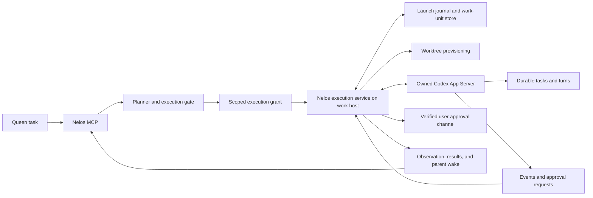
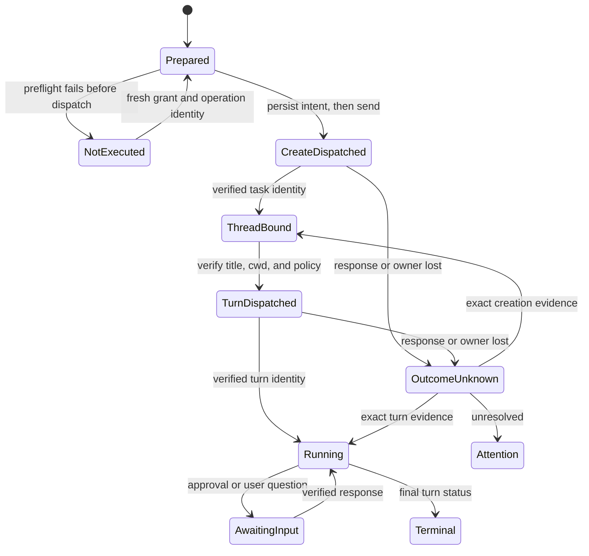

# Proposal: MCP-owned App Server execution

Status: proposed architecture, 2026-09-02. Extends the investigation of
[#125](https://github.com/virusimmortal00/nelos/issues/125). No runtime behavior
or existing permission contract changes with this document.

## Decision

Make Nelos capable of executing approved durable work units through Codex App
Server on the machine where the work lives. Keep the Nelos MCP interface as
the installed product entry point. A supervised Nelos execution service owns
the connection, launch journal, event processing, and recovery. Codex continues
to enforce execution permissions and produce task/turn identities and results.

Select an execution backend before authorizing a wave. An App Server launch
does not depend on the model having Desktop's `create_thread` tool. Native
Desktop and joined-subagent execution remain separate adapters with their own
capability requirements. Changing adapters requires a new proposal and grant;
it is never an implicit retry strategy.

The first target is an authenticated Linux or SSH host with the repository,
Nelos MCP, and a supported Codex executable on that host. Arbitrary remote
containers, Desktop sidebar integration, and cross-host handoff need separate
certification. The presence of a Codex executable alone is insufficient.

## Evidence and version boundary

The [official App Server documentation](https://learn.chatgpt.com/docs/app-server)
describes creation, streaming, approvals, and version-specific schema generation.
`requestAttestation` concerns upstream attestation; it is not a native-launcher
inventory. WebSocket transport remains experimental. These facts establish
candidate interfaces, not a Nelos compatibility guarantee.

The [official changelog](https://learn.chatgpt.com/docs/changelog) lists
`0.152.1`, released September 1, as the latest CLI release checked in this
research. Recent changes relevant here include queued messaging in `0.149.0`,
remote MCP startup fixes in `0.150.0`, tool-discovery and remote permission fixes
in `0.151.0`, and MCP availability across refreshes in `0.152.0`. No release note
establishes that #125 is fixed upstream.

Local inspection used the installed `codex-cli 0.152.0`. Both default and
`--experimental` JSON schemas were generated without starting a task. The
[research inventory](app-server-protocol-research-2026-09-02.json) records
selected methods, field names, and schema hashes. Inclusion in the default
schema is not a declaration that an API is stable or enabled for an account.
The `0.152.1` runtime and the reported remote host were not exercised here.

The existing [compatibility contract](app-server-compatibility-contract.md)
separates the strict MCP bridge from conditional CLI creation. This proposal
adds an execution profile; it does not silently widen the old read profile or
declare every runtime above its minimum version safe for mutations.

## What the repository already provides

| Existing component | Reuse | Required change |
| --- | --- | --- |
| `src/mcp-app-server-bridge.mjs` | Bounded JSONL transport, initialization, response validation | Step 1 adds separate event/server-request dispatch and discovery; the supervisor must own its consumers |
| `src/app-server-client.mjs` | Explicit Unix-WebSocket transport | Step 1 shares the bidirectional dispatcher; product execution still needs target and runtime validation |
| `bin/nelos` | Actual `thread/start`, title verification, and `turn/start` flow | Extract library operations; do not shell out to the optional CLI from the installed plugin |
| `src/worktree-provisioning.mjs` | Repository locking and worktree receipts | Bind provisioning to the approved execution target and final working directory |
| `src/execution-store.mjs` | Durable work-unit identity, revisions, binding | Add a separate launch-operation journal and guarded non-execution recovery |
| `src/launch-execution-gate.mjs` | Exact wave/member matching | Replace caller-authored capability authority with service-owned grants |
| `src/runtime-worker-registry.mjs` | Strong process identities and generation fencing | Extend ownership to an execution service; existing MCP-worker leases are not a task supervisor |
| Observation, acceptance, and spinoff lifecycle modules | Result validation, dependency joins, cleanup policy | Consume executor evidence and route parent wake/cleanup through the recorded backend |

Two existing behaviors prevent simply adding a `thread/start` method: the
bridge has no verified approval relay, and `close()` terminates its child.
An execution process must outlive a transient MCP connection when it owns work.

## Process and ownership model

Use one elected execution-service owner per configured host, Codex home, and
authorization domain. Record its process-start identity, runtime generation,
and connection epoch. Partition App Server connections when effective account,
provider, or process configuration differs. Serialize mutations of each task;
allow independent tasks to run concurrently within the approved limit.

The service initially owns a child using the documented stdio transport. MCP
front ends attach through a private, versioned local control channel. Startup
uses an ownership lock; losing starters attach to the verified winner. Child
MCP instances must reuse this service instead of recursively creating one
App Server per work unit. Restrict clients to scoped Nelos operations rather
than exposing a general RPC proxy or arbitrary process launcher.

Pin the service to its loaded plugin generation. Drain before replacement;
reuse runtime mutation fencing so an upgraded front end cannot mutate through
an incompatible old service. Detaching a front end does not release running
work. Shut down only after active operations and requests settle, client leases
expire, and the configured idle grace period elapses. Stop only owned processes.
After an executor or machine crash, reconcile durable state before resuming;
persisted threads do not imply that their turns continued while the server was
down. Automatic restart after host reboot is a later service-installation choice.

An explicitly configured, verified host-owned endpoint can be another adapter.
Do not assume the proposed `CODEX_APP_SERVER_CONTROL_ENDPOINT` contract is
injected by Codex or attach to a guessed Desktop socket.

## Remote placement

The [remote documentation](https://learn.chatgpt.com/docs/remote-connections)
states that SSH projects use the remote filesystem and shell, and require
Codex installation and authentication on that host. Remote access retains the
host's credentials, permissions, and tools.

For the initial implementation, keep execution beside that repository and use
local stdio there. Record a target containing host identity, Codex-home
identity, repository identity, working directory, and optional environment ID.
Never apply the queen machine's path normalization to a foreign path.

A later transport can use an approved Unix endpoint or an authenticated
connection over SSH/TLS. Desktop Remote, a direct App Server connection, and a
remote Code Mode host are different integrations; support for one does not
establish support for the others. In particular, `--code-mode-host` is not the
switch for selecting a Desktop remote project.

## Capability and authorization contract

Proposed protocol identifiers below are Nelos additions, not existing tools.

1. The planner records `executionBackend` and `executionTarget` for each member.
   The wave digest includes both. Capability checks cover planning, launch,
   observation, approval handling, results, and any requested detached wake.
2. The service derives capability evidence from its actual adapter, reviewed
   schema profile, connection handshake, bounded account/model/config queries,
   target checks, and available user-interaction channel. Each capability is
   `supported`, `unsupported`, or `unknown`, with an evidence source.
3. Creation permission comes from the existing user authorization and the
   host's real tool-approval/policy path. Caller fields such as
   `userIntentConfirmed: true` cannot supply capability or permission evidence.
   If the host cannot supply the required authorization context, return a
   typed authorization requirement. Do not describe a model assertion as a
   host attestation.
4. The service stores a scoped grant and returns its opaque `executionGrantId`.
   Bind it to the wave, target, owner epoch, account/config fingerprint,
   allowed operations, exact route, approval policy, and expiry. A digest is
   useful for matching, but is not a substitute for looking up this record.
5. The gate checks every member before emitting an executable wave. The launch
   adapter validates the grant again before persisting dispatch intent and
   before sending a mutation. Unknown or changed evidence produces a typed
   non-launch action, never another backend's capability claim.

Name the source `nelos-executor`, with the profile and epoch, rather than
`native-host`. Scope and protect the service channel and grant store. Opaque
IDs prevent accepting fabricated receipt contents; they do not make an
otherwise untrusted local caller authorized.

Live model discovery narrows Nelos's routing catalog; it does not silently
upgrade or replace a requested model/effort. `app/installed` describes connector
availability, and `mcpServerStatus/list` describes MCP servers. Neither proves
that a Desktop built-in `create_thread` tool exists. Preserve this distinction
for the native adapter too.

## Launch protocol and recovery

Before dispatch, preflight the entire wave. After dispatch starts, multi-task
creation is not transactional: record any partially created members and stop
downstream work until they are reconciled.

The operation journal records work-unit revision, execution attempt, separate
launch sequence, wave/grant IDs, owner epoch, target, request digest, dispatch
stage, verified thread/turn IDs, and evidence references. Persist the bounded
approved launch payload privately so recovery can reproduce intent; exclude
credentials and unrelated transcripts.

The execution sequence is:

1. Validate the grant and reserve the exact work-unit operation under lock.
2. Provision an isolated worktree, verify its ownership receipt, then validate
   the permission profile against the final working directory.
3. Persist creation intent and dispatch `thread/start` with explicit route,
   workspace, persistence, and policy settings from the approved contract.
4. Durably bind the returned task identity immediately, before title setting
   or starting a turn. Validate identity, working directory, effective policy,
   and returned route. Preserve a created-but-not-started task for recovery.
5. Set and verify the title. Persist turn intent, then dispatch `turn/start`
   with exact effort, input, and a deterministic client message ID where
   supported by the selected profile. Bind its turn ID separately.
6. Stream bounded progress. Verify the final result through the existing
   result contract before queen acceptance or subsequent dependency waves.

No caller-assigned creation ID or idempotency key exists in the inspected
`ThreadStartParams`. A JSON-RPC ID and a successful socket write are not a
creation receipt. A client message ID is correlation evidence, not an assumed
exactly-once guarantee. Lost responses require bounded reconciliation; matching
titles or an empty listing alone cannot authorize recreation. A per-launch
source marker may help only after its round-trip behavior is certified.

Add a typed `launch-not-executed` outcome for service-proven non-dispatch or a
specifically classified rejection known to occur before creation. It closes
that operation and restores a resumable work unit under a new launch sequence;
late receipts for the closed operation are rejected. Retain `launch-outcome-unknown`
when a mutation might have reached the server. Never convert a timeout into
non-execution or reset an already bound task to unbound.

Legacy #125 records have no service journal. Import them as reconciliation
cases; do not retrospectively attest that a native call was never made. An
independently verified non-invocation can enable the explicit recovery action.

## Events, approvals, authentication, and results

Implement a shared bounded dispatcher that separates responses, notifications,
and server-initiated requests before looking up IDs. Incoming request IDs and
outgoing request IDs occupy separate namespaces. Preserve error codes and
correlation, not only an error string. Keep processing responses and approval
traffic while an MCP caller waits; never hold a global tool lock across a
worker turn or user interaction.

The service maintains a bounded event projection and reconciles after a
connection gap. A local event cursor is not an upstream replay cursor. A turn
ending successfully is evidence of execution, not of acceptance. Preserve the
existing result-envelope validation, exact turn provenance, and queen decision.

App Server permission profiles and MCP permissions have different scopes.
The [permission documentation](https://learn.chatgpt.com/docs/permissions)
explicitly separates sandboxed commands from MCP, connector, browser, and
Computer Use controls. Consequently, the service's own provisioning and
control methods also need scoped authorization; a worker sandbox does not
constrain a privileged MCP handler.

Relay approval requests and user questions through a verified interactive
channel, preserving task, turn, request ID, allowed decisions, and deadline.
MCP elicitation is one candidate only when the actual front end advertises and
passes it. Do not assume that a separately launched server's prompts appear in
Desktop automatically. If the channel disconnects, leave the task awaiting
input or decline/cancel according to policy; never synthesize approval. Permit
unattended execution only under a previously authorized policy that can run
without interactive grants. Do not switch to `approvalPolicy: never` merely
to avoid implementing a relay.

Reuse Codex-managed authentication on the execution host. The
[authentication documentation](https://learn.chatgpt.com/docs/auth) documents
cached login and managed refresh. Nelos should query readiness, report an
authentication requirement, and let the user's selected login flow resolve it.
It should not copy Desktop credentials, change billing modes, or claim to own
external-token refresh or attestation without an actual provider. Secrets stay
out of journals, receipts, tool output, and diagnostic logs.

For completion, prefer the service's observed terminal result over requiring
the worker to call a native messaging tool. Persist a parent-wake outbox.
Evaluate queue-based wake against both an active and an unloaded queen owned
by another process. Do not resume or steer that queen through an independent
server merely because its session files are readable. Until cross-owner wake
is certified, require the queen to remain in the join loop or explicitly
report that detached wake is unavailable before accepting detached work.

## Current API candidates

The following choices are proposed uses of the local schema inventory, not
claims of successful runtime execution. The current official docs are linked
above; a schema-only candidate cannot pass a release gate by itself.

| Candidate | Proposed use | Adoption boundary |
| --- | --- | --- |
| `model/list`, `modelProvider/capabilities/read` | Exact model/effort and provider preflight | First slice; do not infer native tool availability |
| `permissionProfile/list`, `configRequirements/read` | Validate the requested policy on the target | First slice; preserve managed restrictions and profile provenance |
| `thread/start`, `thread/name/set`, `turn/start`, `turn/interrupt` | Owned task lifecycle | First slice, with separate creation and execution identities |
| Turn/item/status notifications; bounded turn reads | Live progress and terminal result collection | First slice; notification gaps trigger reconciliation |
| `clientUserMessageId`, `sessionId`, `instructionSources` | Correlation and diagnostic provenance | Validate returned semantics; none is a creation grant |
| `thread/queue/*` | Durable follow-ups and parent wake | Experimental; test cross-process delivery, deduplication, and ownership before relying on it |
| `environment/info`, environment selection | Execution in a configured environment | Later; avoid this dependency for a service already on the work host |
| `mcpServerStatus/list`, `app/installed` | Check worker dependencies | Actual runtime state only; no substitute for built-in host-tool checks |
| Initialization `extensions` | Negotiate supported interaction extensions | Generated schema favors it over the legacy extended-form switch; verify host interoperability |
| `dynamicTools`, `outputSchema` | Structured completion or narrow service callbacks | Later experiment; never expose a generic privileged executor |
| `thread/fork`, `thread/goal/*` | Explicit history reuse or user-requested goals | Optional; do not relabel a fork as a joined subagent |
| Plugin management, raw item injection, process APIs | No initial requirement | Keep outside the execution profile |

Retain legacy history for the first release. Do not assume schema-present
paginated history, project IDs, or environment features are enabled. Preserve
Nelos parentage in its own ledger: a durable root task need not report the
queen as its native `parentThreadId`. The initial remote planner can remain
native when available; otherwise designing a supervised planner task is an
explicit additional route, not a silent substitution for joined subagents.

## Implementation progress

The initial source implementation covers step 1 below:

- `src/app-server-rpc-dispatcher.mjs` now serves both transports. It separates
  incoming and outgoing request IDs, routes ordered bounded notifications,
  bounds pending interactions, cancels stale replies, and rejects requests when
  no handler exists. Numeric server error codes survive transport projection.
- `src/app-server-execution-profile.mjs` and the bridge's `probeExecution`
  method perform bounded live discovery on one connection. They compare the
  exact model/effort and permission profile, read managed approval-policy
  restrictions, and query configured authentication without requesting refresh.
- The reduced `0.152.0` discovery fixture and offline transport tests cover
  collisions, interleaving, deadlines, pagination, malformed responses, missing
  routes, disconnection, and stale callbacks. Compatibility selection includes
  a separate development capability with no certified runtime releases.

The subsequent [admission and recovery implementation](executor-admission-and-recovery.md)
adds private service grants bound to exact execution waves, a synced launch
journal, opaque non-dispatch proofs, guarded work-unit recovery, and a launch
coordinator. Fixture tests exercise a two-member launch, duplicate calls, route
and title failures, partial waves, stale grants, lost responses, and recovery
without repeating upstream effects.

These remain library foundations. No owned-execution MCP tool is enabled yet;
the native receipt gate and legacy launch-pending recovery are not replaced.
A successful discovery result explicitly grants no execution authority. Next
are the supervised process, real target and worktree validation, production
policy providers, App Server effects and approval relay, then observation and
result collection. No remote runtime or live worker turn has been exercised by
these implementation steps.

## Implementation sequence and release proof

| Step | Concrete deliverable | Required evidence |
| --- | --- | --- |
| 1. Transport and profile | Bidirectional dispatcher, reduced execution schemas, typed errors, bounded preflight | Interleaved events/requests/responses, colliding IDs, unknown methods, model/policy mismatch, and backpressure tests |
| 2. Gate and recovery | Service grant lookup, target-bound wave identity, launch journal, typed non-execution reconciliation | #125 with false positive claims, tampered/stale grants, missing adapters, mixed waves, late receipts, and unknown outcomes |
| 3. Owned execution | Service election/drain, worktree provisioning, create-bind-title-start flow, approval relay | One isolated worker completes on Linux without Desktop creation tools; no recursive service spawning |
| 4. Join and wake | Event projection, result validation, wake outbox, backend-owned cleanup | Two workers join correctly; queue and cross-owner tests establish detached-wake support or keep it unavailable |
| 5. Product rollout | Versioned MCP schema, backend configuration, migration, docs/skill, compatibility and Desktop certification | Remote and local canaries, upgrade/restart recovery, and negative cases below |

Certify against the exact `0.152.1` distribution and the actual remote runtime,
not only this machine's `0.152.0` schema. Add independent records for tested
platforms and artifacts. Keep the existing read bridge's compatibility policy
separate from execution admission.

The release scenario is two explicitly requested remote spinoffs with native
creation tools absent: distinct isolated worktrees, exact routes and effective
permissions, real thread/turn IDs, bounded progress, validated results, and
successful parent join. Also exercise approval denial/disconnection, auth
expiry, missing required MCP tools, multiple MCP front ends, service restart,
response loss after creation and turn dispatch, stale grants after config
changes, partial waves, and cleanup after failures. Verify Desktop discovery,
live status, approvals, and handoff separately before advertising them.

Do not commit real turns or create live spinoffs during architecture research.
The first implementation milestone should produce the smallest complete
remote create/run/observe/collect flow, including approvals and recovery,
before enabling optional queue, environment, or dynamic-tool functionality.

### Owned connection implementation

`ExecutorAppServerSessionV1` now supplies a separate service-owned stdio
connection. It uses explicit executable, work-host cwd, and Codex home, requires
the reviewed 0.152.0 initialization shape/version, and assigns a unique
connection ID. It never reconnects or retries requests. Cancellation or a lost
response does not assert that an upstream mutation was canceled; the launch
journal retains that uncertainty. The session drains stderr without retaining
it and bounds requests, framing, output, events, and server-request handlers.

Only the owner may close the session. Shutdown aborts pending handlers and
signals the actual child handle, escalating after a bounded grace period.
Frontend attachment, owner election, and service-channel authorization are not
provided by this transport. A read-only handshake with the installed 0.152.0
binary verified its `Codex Desktop/0.152.0` identity on 2026-09-02; it did not
create a task or certify execution. Mock coverage also checks CLI identities,
wrong-home/version rejection, failure, response loss, and late approvals.
