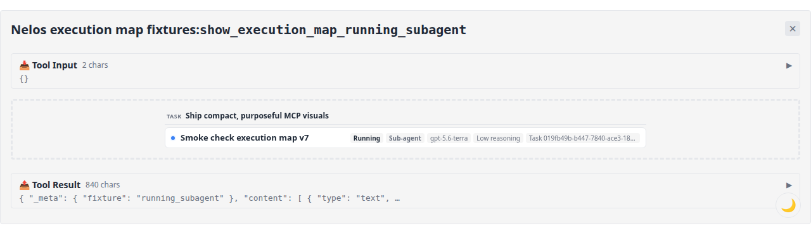
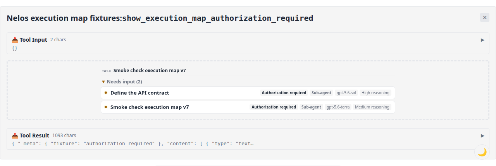
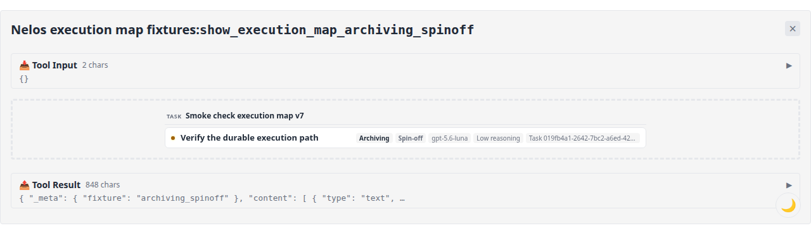
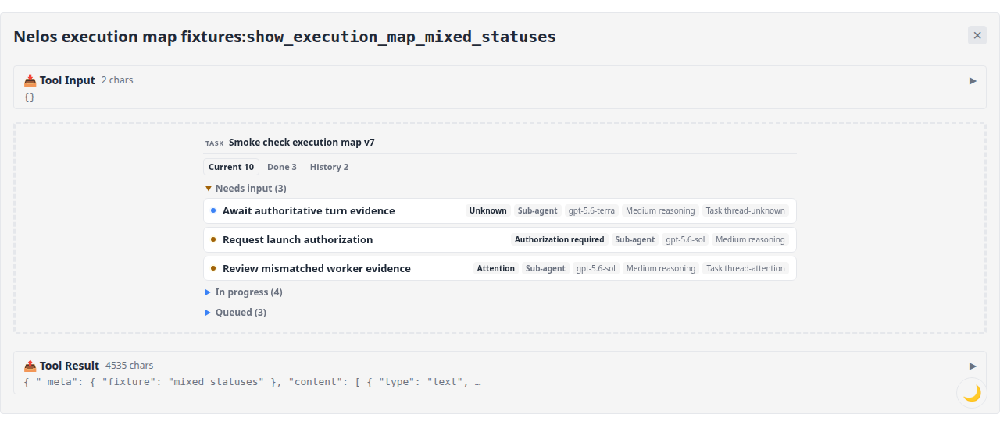
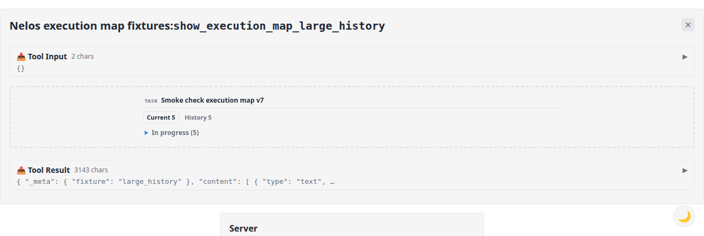
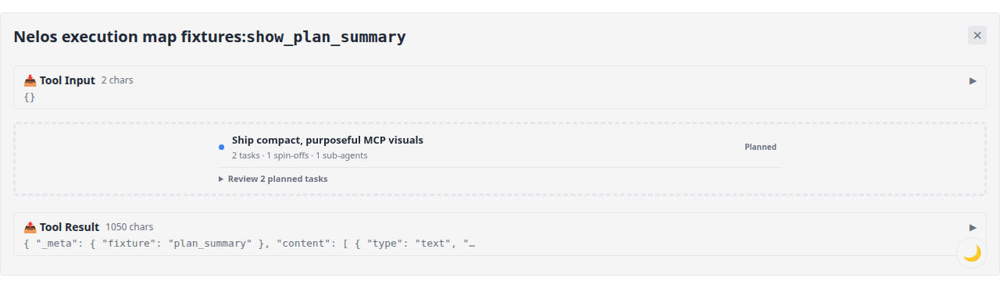
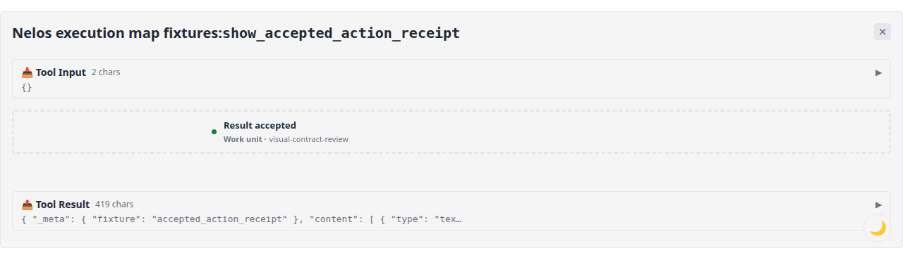

# MCP visual evidence

These screenshots were captured from the production MCP Apps resources in the
official reference host through optional maintainer-only infrastructure. Access
to the visual runner is not required to build, test, or contribute to Nelos.
Each capture uses the final source tree, reaches `Tool Result`, and reports no
browser console errors. The public fixture and host contracts are checked in and
covered by the repository test suite.

## Single running worker

A lone worker renders directly. Its status is an attribute of the worker rather
than an expandable hierarchy level.

## Authorization required

Multiple workers that need input share one purposeful disclosure group. Exact
statuses remain visible on the worker rows.

## Archiving spin-off

The direct row preserves the parent task, lifecycle, model, reasoning, native
task identity, and active status without adding a generic status container.

## Mixed current work

Large maps default to the relevant `Current` view. `Needs input` opens
automatically, while `In progress` and `Queued` remain compact. Terminal and
archived workers are available through the count-bearing `Done` and `History`
filters.

## Larger history

Current and historical workers remain one click apart without presenting every
raw status as a navigation category.

## Plan summary

Planning tools use a dedicated compact summary rather than an execution-state
placeholder.

## Accepted action receipt

Outcome tools use a concise receipt that labels the affected work unit.

